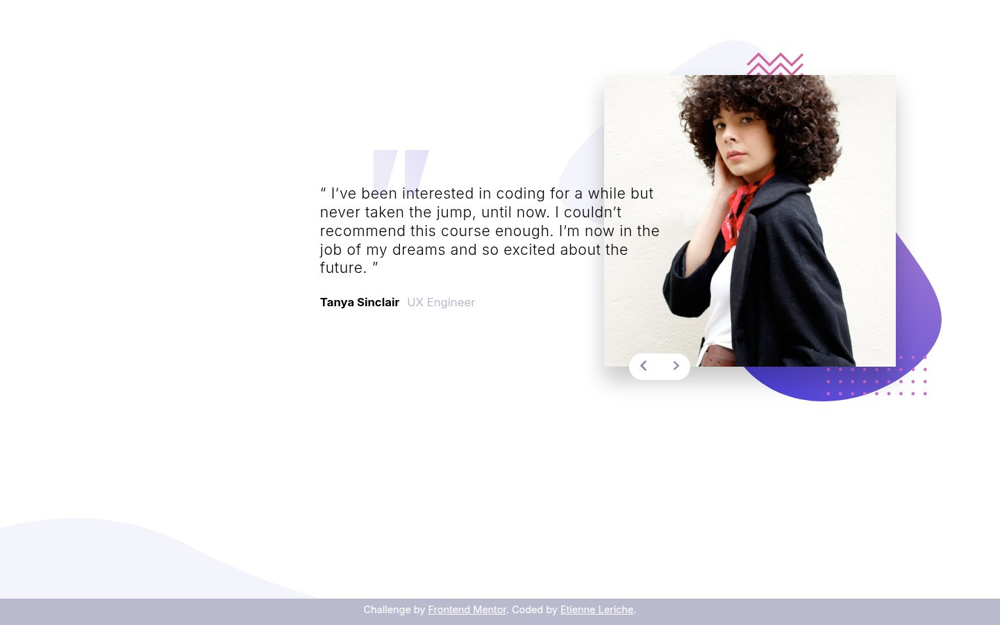

# Testimonial slider

Un slider de témoignages en deux slides : citation, auteur et photo, avec navigation par flèches.



**Démo : [el-cassegrain.github.io/testimonial-slider](https://el-cassegrain.github.io/testimonial-slider/)**


## Contexte

Solution du challenge « Coding Bootcamp Testimonials Slider » de [Frontend Mentor](https://www.frontendmentor.io).

## Fonctionnalités

- Défilement entre les témoignages avec les flèches
- Mise en page responsive : image au-dessus du texte sur mobile, côte à côte sur desktop
- Décors de fond (courbe, motifs) positionnés en CSS pour coller à la maquette
- Styles organisés en partials Sass (`_variables`, `_global`)

## Installation

C'est un site statique, sans étape de build pour le JavaScript.

```bash
git clone https://github.com/El-Cassegrain/testimonial-slider.git
cd testimonial-slider
pnpm dlx serve .
```

Pour modifier les styles, recompile le Sass :

```bash
pnpm dlx sass --watch sources/scss/style.scss assets/css/style.css
```

---

Réalisé par [Etienne Leriche](https://etienneleriche.com), designer UI/UX et développeur front-end.
